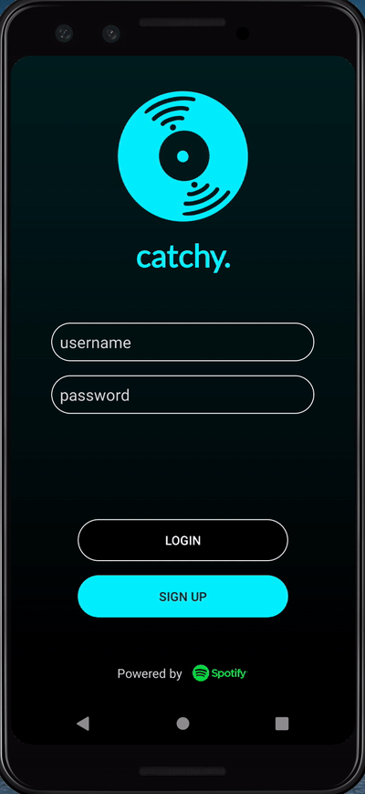

catchy.
===

## Table of Contents
1. [Description](#Description)
1. [Login Page](#Login-Page)
1. [Home Feed](#Home-Feed)
1. [Details Page](#Details-Page)
1. [Search Page](#Search-Page)
1. [Profile Page](#Profile-Page)
1. [Find Friends](#Find-Friends)
1. [Settings](#Settings)
1. [Video Walkthrough](#Video-Walkthrough)
2. [Credits](#Credits)

## Description

**catchy.** is a Spotify-powered music recommendation app that helps users find their new favorite songs. Users can swipe through
different song profiles, search for tracks, save liked songs, follow other users, and more. 

Initial draft design linked [here](https://hackmd.io/4D37lwvUQty_SWYcwjvHPQ). 

## Login Page

  
   

### Product Spec: 
- [x] User can log in or sign up 
- [x] Error handling if user isn't logged into or hasn't installed Spotify

## Home Feed

  
   

### Product Spec:
- [x] Profiles constructed for each song
- [x] Tiktok-like mechanism that allows users to swipe for new song profiles 
- [x] Infinite refresh as songs are continuously loaded from Spotify / Parse
- [x] Users can double-tap to like / unlike songs
- [x] Users can single-tap to pause / resume playing
- [x] Users can tap on song title to reach its details page through an 
animated shared element activity transition
- [x] Song profile plays on loop

## Details Page

  
   
  

### Product Spec:
- [x] Additional playback features such as fast-forwarding, rewinding, pausing / resuming
- [x] Users can double-tap to like / unlike songs
- [x] Background color changes dynamically based on album art (bitmap loading with LRU cache)

## Search Page

### Product Spec:
- [x] User can search for new songs via track title or artist title
- [x] User can tap search result to view song details
- [x] Search function has infinite load
- [x] Background color changes dynamically based on current user's profile picture 

## Profile Page

  
    

### Product Spec:
- [x] Each user has an individual profile picture, full name, and bio
- [x] User can tap profile image to access full name and bio
- [x] User profile displays list of favorite songs
- [x] User can view following / follower lists
- [x] Background color changes dynamically based on user's profile picture

## Find Friends

### Product Spec:
- [x] User can tap search result to view other users' profile pages
- [x] Search function has infinite load 
- [x] Current user can follow / unfollow other users from search results
- [x] Background color changes dynamically based on current user's profile picture

## Settings

  
   
   

### Product Spec:
- [x] User can set new full name or bio
- [x] User can change profile picture by taking a picture through the native camera app or uploading
an existing one from the photo gallery
- [x] User can toggle between having explicit content filtered out from song recommendations or not
- [x] User can toggle between listening to a 30-second snippet of a song in the home feed or its full duration
- [x] User can view about popup page
- [x] Background color changes dynamically based on current user's profile picture

## Video Walkthrough

A more comprehensive video walkthrough of all the app features can be found [here](https://youtu.be/gf21rzDk0N8). 

## Credits

3rd party libraries, icons, and graphics used:
* [**catchy.** logo design by Catherine He](https://github.com/catherinexhe) 
* [Material Design Icons](https://material.io/resources/icons/?style=baseline)
* [Revely Gradient](https://github.com/revely-inc/co.revely.gradient)
* [Spotify Android SDK](https://github.com/spotify/android-sdk)
* [Spotify Web API for Android](https://github.com/kaaes/spotify-web-api-android)
* [Glide](https://github.com/bumptech/glide)
* [Picasso](https://github.com/square/picasso)
* [Android FadingEdgeLayout](https://github.com/bosphere/Android-FadingEdgeLayout)
* [Parse SDK for Android](https://github.com/parse-community/Parse-SDK-Android)
* [Parceler](https://github.com/johncarl81/parceler)

