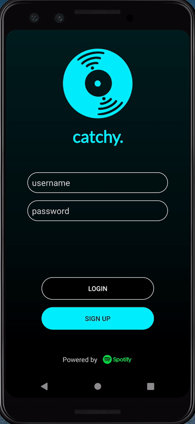

catchy.
===

## Table of Contents
1. [Description](#Description)
1. [Product Spec](#Product-Spec)
1. [Video Walkthrough](#Video-Walkthrough)
2. [Credits](#Credits)

## Description

**catchy.** is a Spotify-powered, music recommendation app that helps users find their new favorite songs. Users can swipe through
different song profiles, search for tracks, save liked songs, follow other users, and more. 

Initial draft design [here](https://hackmd.io/4D37lwvUQty_SWYcwjvHPQ). 

## Product Spec

### Login Page

### Home Feed

### Details Page

  
   
  

### Search Page

### Profile Page

### Find Friends

### Settings

## Video Walkthrough

## Credits

3rd party libraries, icons, and graphics used:
* **catchy.** icon design by Catherine He 
* [Material Design Icons](https://material.io/resources/icons/?style=baseline)
* [Revely Gradient](https://github.com/revely-inc/co.revely.gradient)
* [Spotify Android SDK](https://github.com/spotify/android-sdk)
* [Spotify Web API for Android](https://github.com/kaaes/spotify-web-api-android)
* [Glide](https://github.com/bumptech/glide)
* [Picasso](https://github.com/square/picasso)
* [Android FadingEdgeLayout](https://github.com/bosphere/Android-FadingEdgeLayout)
* [Parse SDK for Android](https://github.com/parse-community/Parse-SDK-Android)
* [Parceler](https://github.com/johncarl81/parceler)

