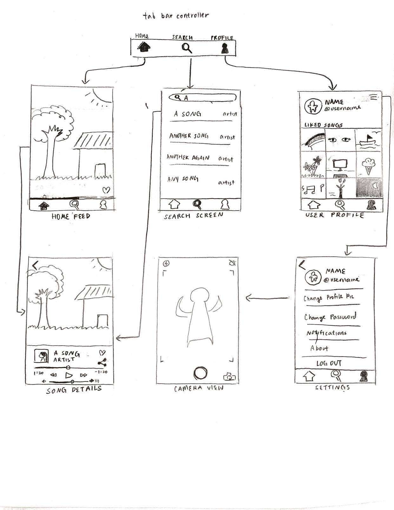

Original App Design Project - README 
===

# catchy.

## Table of Contents
1. [Overview](#Overview)
1. [Product Spec](#Product-Spec)
1. [Wireframes](#Wireframes)
2. [Schema](#Schema)

## Overview
### Description
catchy. is an Android app for people to discover new trending music. Users can swipe through different song profiles (like Tiktok, or Tinder) that play a 30-second snippet on loop, and tap on ones they like to listen to the entire song. Furthermore, users can like and share favorite songs through their timeline.  

HackMD link here: https://hackmd.io/4D37lwvUQty_SWYcwjvHPQ

### App Evaluation

- **Category:** Music / Social
- **Mobile:** Mobile-first experience. Uses the camera to set user profile picture.
- **Story:** Allows users to discover new songs as introduced by currently trending charts and a personalized, content-based recommendation system.  
- **Market:** Anyone looking for a new favorite song. Possibly millennial / Gen Z appeal as the layout would be visually similar to Tiktok. 
- **Habit:** Users can also share songs they enjoy to their social circle. 
- **Scope:** We first start with letting users discover new songs from trending charts, but in the future we could bring in songs from other eras as well.    

## Product Spec

### 1. User Stories (Required and Optional)

**Required Must-have Stories**

* User can log in or sign up
* User has an individual profile page, with option to change profile image
* User profile displays list of favorite songs
* Song profiles constructed for each song (likely integrating Spotify SDK or SoundCloud API)
* Tiktok-like mechanism that allows users to swipe up to view new song profiles (infinite refresh)
* Users can double-tap to "like" songs that later appear on their profile page (gridview of album art)

**Optional Nice-to-have Stories**

* Include song progress bar in song profile, song detail view
* User can search for other users and follow them
* User can view other users' profile pages
* User can view following / follower lists
* Generate visualization of music in song profile
* More sophisticated recommendation algorithm (no repeats, similar genres / moods, etc.)
* Settings notifications (user followed, etc.)

### 2. Screen Archetypes

* Login
* Register
* User Profile Screen
    * Allows user to upload a photo and fill in screenname. Shows a gridview of liked songs that, upon clicking the cover art, pulls up the song detail screen. 
* Feed Screen
    * Allows user to swipe through song profiles. Each song profile displays the cover art and plays a short snippet of the song on loop. Has like / share capabilities.
* Song Detail Screen
    * Allows user to play the song in its entirety. Has like / share capabilities.
* Search Screen
    *  User can search for other users (which then navigates to their profile screen)
* Settings Screen
    * Push notifications, music genre preferences, blacklisted songs

### 3. Navigation

**Tab Navigation** (Tab to Screen)

* Home feed
* User profile
* Search screen

**Flow Navigation** (Screen to Screen)

* Login screen
  => Home feed
* Registration screen
  => Home feed
* User profile
  => Settings screen
  => Song details
* Home feed (displays one song profile at a time)
* => Song details

## Wireframes

### [BONUS] Digital Wireframes & Mockups

### [BONUS] Interactive Prototype

## Schema 
[This section will be completed in Unit 9]
### Models
[Add table of models]
### Networking
- [Add list of network requests by screen ]
- [Create basic snippets for each Parse network request]
- [OPTIONAL: List endpoints if using existing API such as Yelp]
